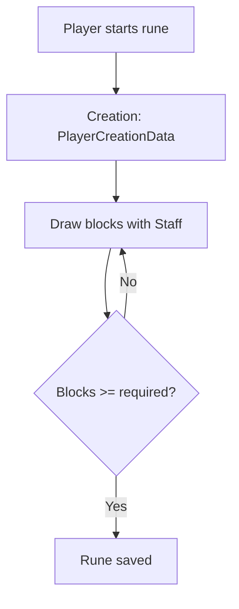
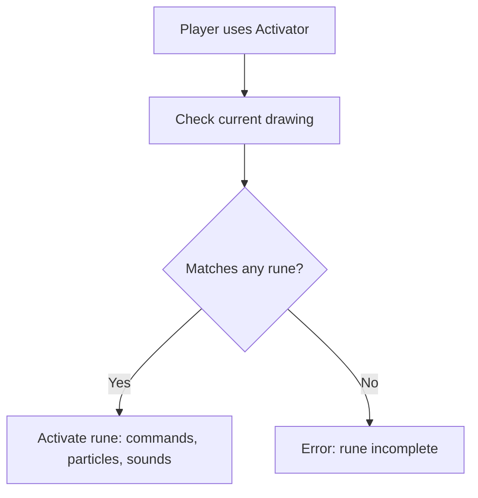

# KRunes v2.0

Dynamic Rune System for Minecraft with customizable particles, sounds, and commands.

---

## Plugin Information

* **Name:** KRunes
* **Version:** 2.0
* **Main class:** `me.erik.kRunes.KRunes`
* **API version:** 1.21

### Command

* `/Krune` - Gives the player the Rune Chalk.

---

## Plugin Items

| Item                 | Name           | Material  | CustomModelData | Description                         |
| -------------------- | -------------- | --------- | --------------- | ----------------------------------- |
| creation             | Creation Staff | STICK     | 1001            | Use to draw the rune: `%rune%`      |
| chalk                | Rune Chalk     | STICK     | 1002            | Use to draw runes on the ground     |
| activator            | Rune Activator | BLAZE_ROD | 1003            | Use to activate runes on the ground |

---

## Effects Configuration (`config.yml`)

### Particles

| Type     | Particle         | Amount | Speed |
| -------- | ---------------- | ------ | ----- |
| draw     | REVERSE_PORTAL   | 5      | 0.01  |
| activate | TOTEM_OF_UNDYING | 100    | 0.5   |
| fail     | SMOKE_NORMAL     | 100    | 1.0   |

### Sounds

| Type     | Sound                     | Pitch | Volume |
| -------- | ------------------------- | ----- | ------ |
| draw     | BLOCK_AMETHYST_BLOCK_STEP | 1.0   | 1.0    |
| activate | ENTITY_PLAYER_LEVELUP     | 1.2   | 1.0    |
| fail     | ENTITY_GENERIC_EXPLODE    | 1.5   | 3.0    |

---

## Messages (`messages.yml`)

### General

```yaml
general:
  prefix: "&7[&bKRunes&7] "
  player_only: "&cOnly players can use this command!"
  no_permission: "&cYou don't have permission to do this!"
  reload_success: "&aReloaded!"
  unknown_command: "&cUnknown command. Use /krunes help"
```

### Errors

```yaml
errors:
  invalid_rune: "&cThis rune doesn't exist!"
  not_active: "&cThis rune is incomplete!"
  missing_argument: "&cInsufficient arguments. Use &e/krunes help"
```

### Rune Messages

```yaml
rune:
  start: "&aRune has started!"
  success: "&aYou activated the Rune!"
  fail: "&cThe rune failed!"
  complete: "&aThe rune has been completed!"
```

### Command Messages

```yaml
command:
  give_fail: "&aThis item does not exist!"
```

---

## Class Structure

| Class            | Responsibility                                                                     |
| ---------------- | ---------------------------------------------------------------------------------- |
| `KRunes`         | Initializes the plugin, registers commands and events                              |
| `DataManager`    | Handles persistence of runes and temporary creations                               |
| `MessageManager` | Loads and provides configurable messages                                           |
| `EffectsManager` | Handles particles, sounds, and persistent lines                                    |
| `RuneManager`    | Handles rune creation, drawing, and activation                                     |
| Internal         | `RuneData`, `PlayerCreationData`, `PlayerDrawingData`, `ParticleData`, `SoundData` |

---

## Usage Flow

1. Player runs `/Krune` → receives **Rune Chalk**.
2. Uses **Creation Staff** → starts a new rune (`startRuneCreation`).
3. Draws blocks → lines and particles appear (`addCreationBlock`).
4. Completes rune → saved to disk (`saveRuneFromCreation`).
5. Activates rune with **Rune Activator** → commands execute, particles and sounds triggered (`tryActivateRune`).

---

## Placeholders

| Placeholder | Description                             |
| ----------- | --------------------------------------- |
| `%rune%`    | Name of the rune being drawn or created |
| `%command%` | Command associated with the rune        |
| `%player%`  | Name of the player executing the action |

---

## Flow Diagrams

### Rune Creation



### Rune Activation



---

## Summary

* Modular and extensible system: creation, drawing, activation.
* Fully configurable via `config.yml` and `messages.yml`.
* Immersive visual and audio feedback.
* Supports placeholders for messages and commands customization.
